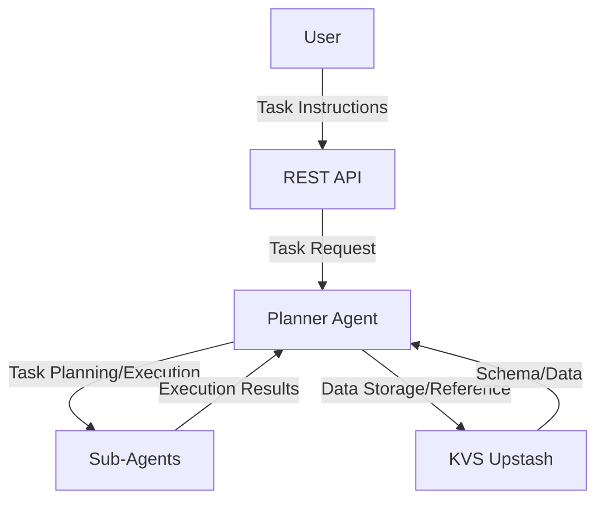

# Agentic Task Management System Prototype

A prototype implementation of a task management system leveraging agentic capabilities.

## Overview

This system receives task management instructions from users through a Planner Agent, which decomposes them into specific tasks (daily/routine-level tasks and information reference tasks) and executes them while referencing information and schemas stored in KVS.

## System Architecture

### Key Components

- **Planner Agent**: Handles task decomposition, planning, and execution coordination
- **Sub-Agents**: Specialized task execution (Web, Coder, Casual, File Agents)
- **KVS (Upstash)**: Persistent storage for hearing results, task schemas, and task data
- **REST API**: Interface layer for user interactions

### Architecture Diagram



## Technology Stack

- **Language**: Python 3.11+
- **Framework**: FastAPI, Pydantic v2
- **LLM**: DSPy (Gemini Flash 2.5)
- **Database**: Upstash Redis
- **Package Management**: uv
- **Code Quality**: Ruff, Pyright

## Setup

### Prerequisites

- Python 3.11 or higher
- uv (Python package manager)

### Installation

```bash
# Clone the project
git clone <repository-url>
cd agentic_pseudo

# Install dependencies
uv sync

# Set up environment variables
cp .env.example .env
# Edit .env file to configure Upstash URL/TOKEN and LLM API keys
```

### Environment Variables

```env
UPSTASH_URL=your_upstash_redis_url
UPSTASH_TOKEN=your_upstash_redis_token
GEMINI_API_KEY=your_gemini_api_key
```

## Usage

### Start API Server

```bash
uv run uvicorn src.api.main:app --reload
```

### Run Tests

```bash
# Lint and format
uv run ruff check .
uv run ruff format .

# Type checking
uv run pyright

# Run tests
uv run pytest tests/acceptance/  # Acceptance tests
uv run pytest tests/integration/ # Integration tests
```

## API Endpoints

### Create Task
```http
POST /api/tasks
{
  "user_instruction": "Please collect information for report creation and then create the report",
  "session_id": "optional-session-id"
}
```

### Save Hearing Results
```http
POST /api/hearing
{
  "session_id": "session-uuid",
  "hearing_result": "User's detailed requirements and configuration information"
}
```

### Get Task Status
```http
GET /api/tasks/{session_id}/status
```

## Project Structure

```
src/
├── api/           # REST API endpoints
├── service/       # Business logic (agent implementations)
├── repository/    # Data access layer (KVS operations)
└── models/        # Data model definitions

tests/
├── acceptance/    # Acceptance tests
├── integration/   # Integration tests
└── unit/          # Unit tests

output/            # Generated artifacts and reports directory
docs/              # Design documents
```

## Key Features

### Task Decomposition and Execution Planning
- Decomposes user instructions into structured tasks
- Manages dependencies between tasks
- Supports dynamic plan updates

### Agent Collaboration
- **Web Agent**: External information search
- **Coder Agent**: Data processing and script execution
- **Casual Agent**: Natural language processing and dialogue
- **File Agent**: File operations and document generation

### KVS Integration
- Persistent storage of hearing results
- Management of task schema definitions
- Tracking of task execution data

## Development Philosophy

- **Test-Driven Development**: Focus on acceptance and integration tests
- **Security First**: Input validation and sensitive information protection
- **Layered Design**: API → Service → Repository → Model
- **Type Safety**: Strict type definitions using Pydantic v2

## License

MIT License