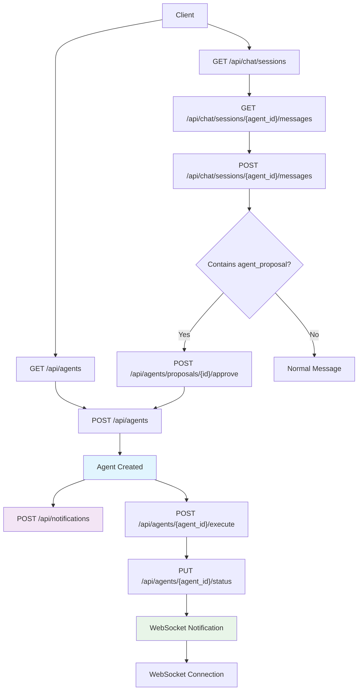
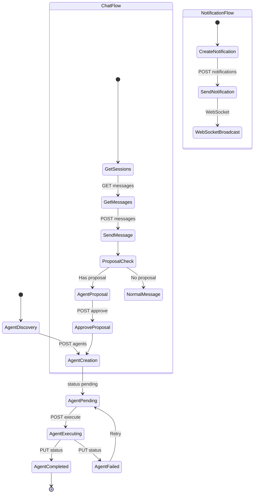
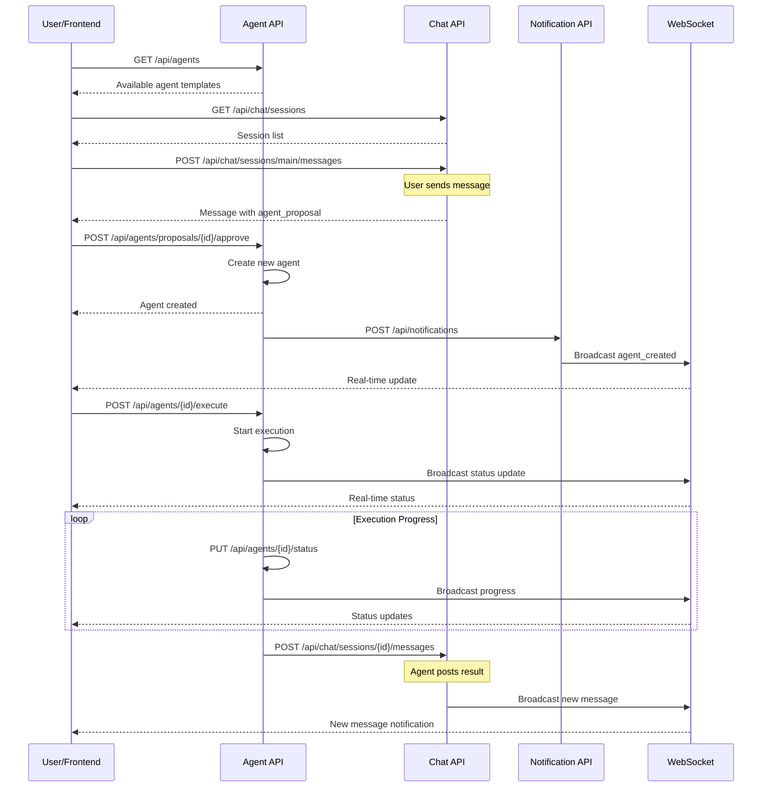
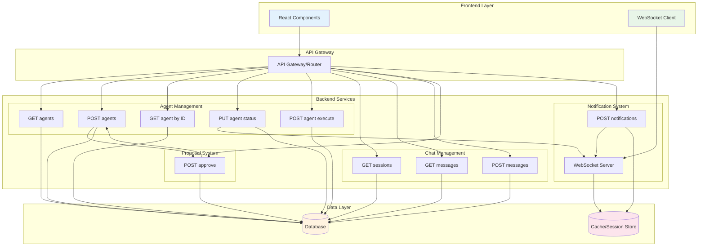
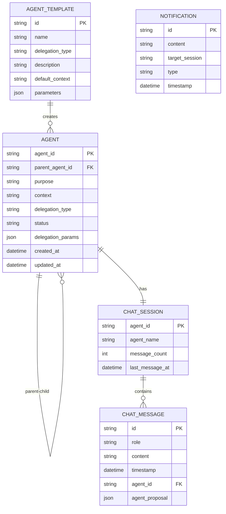

# Backend API v2 - Frontend-v2 対応仕様

## 概要

Frontend-v2 コンポーネントの分析に基づいて、エージェント通信システムに必要なバックエンドAPIを整理し、データスキーマを定義します。

## API関連性ダイアグラム

### 1. APIエンドポイント関係図（フローチャート）



### 2. データフロー図（状態遷移）



### 3. システム相互作用図（シーケンス）



### 4. アーキテクチャ概要図（C4スタイル）



### 5. データ関係図（ER図スタイル）



## 必要なAPIエンドポイント

### 1. エージェント管理

#### GET /api/agents
利用可能なエージェント一覧とテンプレートを取得

**レスポンス:**
```json
{
  "agents": [
    {
      "id": "information_gathering",
      "name": "情報収集エージェント",
      "description": "指定されたトピックについて情報を収集し、整理して報告します",
      "delegation_type": "information_gathering",
      "default_context": "以下のトピックについて詳細な情報を収集してください：",
      "parameters": {
        "search_depth": "detailed",
        "source_types": ["web", "academic", "news"],
        "max_results": 10
      }
    },
    {
      "id": "analysis",
      "name": "分析エージェント",
      "description": "データや情報を分析し、洞察を提供します",
      "delegation_type": "analysis",
      "default_context": "以下のデータを分析し、重要な洞察を抽出してください：",
      "parameters": {
        "analysis_type": "comprehensive",
        "include_charts": true,
        "confidence_threshold": 0.8
      }
    },
    {
      "id": "summarization",
      "name": "要約エージェント",
      "description": "長い文書や情報を簡潔に要約します",
      "delegation_type": "summarization",
      "default_context": "以下の内容を要約してください：",
      "parameters": {
        "summary_length": "medium",
        "include_key_points": true,
        "format": "bullet_points"
      }
    }
  ]
}
```

#### POST /api/agents
新しいエージェントを作成

**リクエスト:**
```json
{
  "purpose": "AI技術の調査と分析",
  "delegation_type": "information_gathering",
  "context": "最新のAI技術トレンドについて調査し、競合分析を行ってください",
  "parent_agent_id": null,
  "delegation_params": {
    "search_keywords": ["AI", "機械学習", "深層学習"],
    "analysis_depth": "detailed"
  }
}
```

**レスポンス:**
```json
{
  "agent": {
    "agent_id": "agent_1703123456_abc123def",
    "parent_agent_id": null,
    "purpose": "AI技術の調査と分析",
    "context": "最新のAI技術トレンドについて調査し、競合分析を行ってください",
    "delegation_type": "information_gathering",
    "status": "pending",
    "delegation_params": {
      "search_keywords": ["AI", "機械学習", "深層学習"],
      "analysis_depth": "detailed"
    },
    "created_at": "2024-01-01T10:00:00Z",
    "updated_at": "2024-01-01T10:00:00Z"
  }
}
```

#### GET /api/agents/{agent_id}
特定のエージェント情報を取得

**レスポンス:**
```json
{
  "agent": {
    "agent_id": "agent_1703123456_abc123def",
    "parent_agent_id": null,
    "purpose": "AI技術の調査と分析",
    "context": "最新のAI技術トレンドについて調査し、競合分析を行ってください",
    "delegation_type": "information_gathering",
    "status": "in_progress",
    "delegation_params": {
      "search_keywords": ["AI", "機械学習", "深層学習"],
      "analysis_depth": "detailed"
    },
    "created_at": "2024-01-01T10:00:00Z",
    "updated_at": "2024-01-01T10:15:00Z"
  }
}
```

#### PUT /api/agents/{agent_id}/status
エージェントのステータスを更新

**リクエスト:**
```json
{
  "status": "in_progress" | "completed" | "failed" | "delegated"
}
```

#### POST /api/agents/{agent_id}/execute
エージェントの実行を開始

**レスポンス:**
```json
{
  "agent_id": "agent_1703123456_abc123def",
  "status": "in_progress",
  "message": "エージェントの実行を開始しました"
}
```

### 2. チャット・メッセージ管理

#### GET /api/chat/sessions
チャットセッション一覧を取得

**レスポンス:**
```json
{
  "sessions": [
    {
      "agent_id": null,
      "agent_name": "メインチャット",
      "message_count": 5,
      "last_message_at": "2024-01-01T10:30:00Z"
    },
    {
      "agent_id": "agent_1703123456_abc123def",
      "agent_name": "AI技術の調査と分析",
      "message_count": 3,
      "last_message_at": "2024-01-01T10:25:00Z"
    }
  ]
}
```

#### GET /api/chat/sessions/{agent_id}/messages
特定のセッションのメッセージ履歴を取得

**レスポンス:**
```json
{
  "messages": [
    {
      "id": "msg_1703123456_def456ghi",
      "role": "system_notification",
      "content": "エージェント間情報受け渡しシステムへようこそ。新しいエージェントの生成や既存エージェントの管理を行えます。",
      "timestamp": "2024-01-01T10:00:00Z",
      "agent_id": null
    },
    {
      "id": "msg_1703123460_ghi789jkl",
      "role": "user",
      "content": "AI技術について調査してください",
      "timestamp": "2024-01-01T10:10:00Z",
      "agent_id": null
    },
    {
      "id": "msg_1703123465_jkl012mno",
      "role": "assistant",
      "content": "この作業は専門的なエージェントに委任することをお勧めします。以下のエージェントを生成しますか？",
      "timestamp": "2024-01-01T10:11:00Z",
      "agent_id": null,
      "agent_proposal": {
        "purpose": "AI技術について調査してくださいに関する情報収集と分析",
        "delegation_type": "information_gathering",
        "context": "ユーザーからの要求: \"AI技術について調査してください\"に基づいて、関連する情報を収集し、分析結果を提供する。",
        "delegation_params": {
          "search_keywords": ["AI技術", "について", "調査"],
          "analysis_depth": "detailed"
        }
      }
    }
  ]
}
```

#### POST /api/chat/sessions/{agent_id}/messages
メッセージを送信

**リクエスト:**
```json
{
  "role": "user",
  "content": "進捗はどうですか？",
  "agent_proposal": null
}
```

**レスポンス:**
```json
{
  "message": {
    "id": "msg_1703123470_mno345pqr",
    "role": "user",
    "content": "進捗はどうですか？",
    "timestamp": "2024-01-01T10:30:00Z",
    "agent_id": "agent_1703123456_abc123def"
  }
}
```

### 3. エージェント提案・承認

#### POST /api/agents/proposals/{proposal_id}/approve
エージェント提案を承認

**リクエスト:**
```json
{
  "agent_proposal": {
    "purpose": "AI技術について調査してくださいに関する情報収集と分析",
    "delegation_type": "information_gathering",
    "context": "ユーザーからの要求: \"AI技術について調査してください\"に基づいて、関連する情報を収集し、分析結果を提供する。",
    "delegation_params": {
      "search_keywords": ["AI技術", "について", "調査"],
      "analysis_depth": "detailed"
    }
  }
}
```

**レスポンス:**
```json
{
  "agent": {
    "agent_id": "agent_1703123480_pqr456stu",
    "parent_agent_id": null,
    "purpose": "AI技術について調査してくださいに関する情報収集と分析",
    "context": "ユーザーからの要求: \"AI技術について調査してください\"に基づいて、関連する情報を収集し、分析結果を提供する。",
    "delegation_type": "information_gathering",
    "status": "pending",
    "delegation_params": {
      "search_keywords": ["AI技術", "について", "調査"],
      "analysis_depth": "detailed"
    },
    "created_at": "2024-01-01T10:35:00Z",
    "updated_at": "2024-01-01T10:35:00Z"
  }
}
```

### 4. システム通知

#### POST /api/notifications
システム通知を送信

**リクエスト:**
```json
{
  "content": "新しいエージェント「AI技術の調査と分析」が生成されました。",
  "target_session": null,
  "type": "agent_created"
}
```

**レスポンス:**
```json
{
  "notification": {
    "id": "notif_1703123490_stu789vwx",
    "content": "新しいエージェント「AI技術の調査と分析」が生成されました。",
    "timestamp": "2024-01-01T10:40:00Z",
    "type": "agent_created"
  }
}
```

## データスキーマ

### AgentInfo
```typescript
interface AgentInfo {
  agent_id: string;
  parent_agent_id: string | null;
  purpose: string;
  context: string;
  delegation_type: string;
  status: "pending" | "in_progress" | "completed" | "failed" | "delegated";
  delegation_params?: Record<string, any>;
  created_at: Date;
  updated_at: Date;
}
```

### ChatMessage
```typescript
interface ChatMessage {
  id: string;
  role: "user" | "assistant" | "system" | "system_notification";
  content: string;
  timestamp: Date;
  agent_id?: string; // どのエージェントのチャットに属するか
  agent_proposal?: {
    purpose: string;
    delegation_type: string;
    context: string;
    delegation_params?: Record<string, any>;
  };
}
```

### ChatSession
```typescript
interface ChatSession {
  agent_id: string | null; // nullはメインセッション
  agent_name: string;
  message_count: number;
  last_message_at: Date;
}
```

### AgentTemplate
```typescript
interface AgentTemplate {
  id: string;
  name: string;
  delegation_type: string;
  description: string;
  default_context: string;
  parameters: Record<string, any>;
}
```

### AgentNode (関係性ビュー用)
```typescript
interface AgentNode {
  id: string;
  label: string;
  status: AgentInfo["status"];
  x?: number;
  y?: number;
}
```

### AgentEdge (関係性ビュー用)
```typescript
interface AgentEdge {
  from: string;
  to: string;
  label?: string;
}
```

## WebSocket リアルタイム通信

### 接続エンドポイント
```
ws://localhost:8000/ws/agents/realtime
```

### 送信メッセージ形式
```json
{
  "type": "subscribe",
  "session_id": "session_123"
}
```

### 受信メッセージ形式
```json
{
  "type": "agent_status_update",
  "agent_id": "agent_1703123456_abc123def",
  "status": "completed",
  "timestamp": "2024-01-01T10:45:00Z"
}
```

```json
{
  "type": "new_message",
  "session_id": "agent_1703123456_abc123def",
  "message": {
    "id": "msg_1703123500_vwx012yz",
    "role": "assistant",
    "content": "調査が完了しました。AIに関する最新情報をまとめました。",
    "timestamp": "2024-01-01T10:50:00Z",
    "agent_id": "agent_1703123456_abc123def"
  }
}
```

## 認証・セキュリティ

### セッション管理
- セッション作成時にUUIDを生成
- WebSocketはセッションIDで認証
- APIキーによる認証（将来実装）

### データ検証
- 全APIエンドポイントでリクエストボディのバリデーション
- エージェント作成時のパラメータ検証
- メッセージ内容のサニタイズ

## エラーハンドリング

### HTTPステータスコード
- `200 OK`: 正常処理
- `201 Created`: リソース作成成功
- `400 Bad Request`: リクエストエラー
- `404 Not Found`: リソースが見つからない
- `422 Unprocessable Entity`: バリデーションエラー
- `500 Internal Server Error`: サーバーエラー

### エラーレスポンス形式
```json
{
  "error": {
    "code": "AGENT_NOT_FOUND",
    "message": "指定されたエージェントが見つかりません",
    "details": {
      "agent_id": "agent_invalid_id"
    }
  }
}
```

## 実装優先順位

### 高優先度
1. **エージェント管理API** - 基本的なCRUD操作
2. **チャット・メッセージAPI** - メッセージ送受信
3. **エージェント提案・承認** - ワークフロー制御

### 中優先度
1. **WebSocketリアルタイム通信** - UX向上
2. **システム通知** - 状態変更の通知
3. **エラーハンドリング強化** - 安定性向上

### 低優先度
1. **認証・セキュリティ** - 将来の機能拡張
2. **ログ・監視** - 運用面の改善
3. **APIドキュメント自動生成** - 開発効率化

## 互換性考慮

### 既存APIとの関係
- 既存のタスク管理APIとは別系統として実装
- 必要に応じてデータ移行ツールを提供
- 段階的な移行を想定した設計

### フロントエンド要件
- TypeScript型定義の提供
- OpenAPI仕様書の自動生成
- モックサーバーの提供（開発時）

この仕様に基づいて、frontend-v2 コンポーネントが期待する全ての機能を実装可能です。