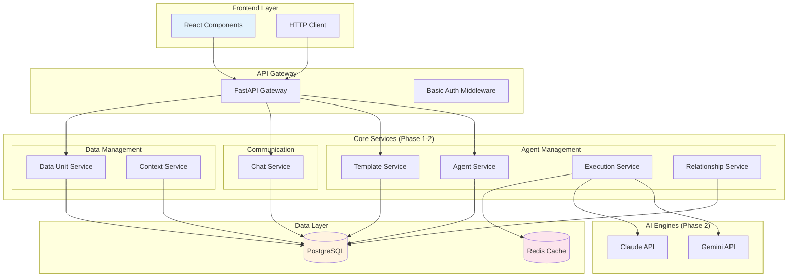
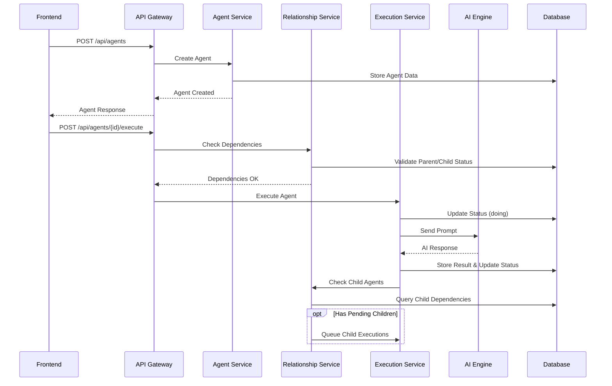

# Backend Design v3 - Frontend-v2 対応設計 (Phase 1-2)

## 概要

Frontend-v2 コンポーネントの詳細分析に基づき、エージェント管理システムの Phase 1-2 機能に必要なバックエンド設計を定義します。Phase 1では基本機能、Phase 2では実行エンジンとエージェント関係性管理に焦点を当てます。

## システム関連性図

### 1. Phase 1-2 システムアーキテクチャ



### 2. エージェント実行フロー (Phase 2)



## 必要なAPIエンドポイント群

### Phase 1: 基本機能

#### 1. エージェント管理API

```http
# 基本CRUD操作
GET    /api/agents                     # エージェント一覧取得
GET    /api/agents/{agent_id}          # 特定エージェント取得
POST   /api/agents                     # 新規エージェント作成
PUT    /api/agents/{agent_id}          # エージェント更新
DELETE /api/agents/{agent_id}          # エージェント削除

# ステータス別取得
GET    /api/agents/status/{status}     # ステータス別一覧
```

#### 2. テンプレート管理API

```http
# テンプレートCRUD
GET    /api/templates                  # テンプレート一覧
GET    /api/templates/{template_id}    # 特定テンプレート取得
POST   /api/templates                  # 新規テンプレート作成
PUT    /api/templates/{template_id}    # テンプレート更新
DELETE /api/templates/{template_id}    # テンプレート削除

# テンプレート使用
POST   /api/templates/{template_id}/use      # テンプレートからエージェント作成
```

#### 3. チャット・メッセージAPI

```http
# メッセージ管理
GET    /api/agents/{agent_id}/conversations  # 会話履歴取得
POST   /api/agents/{agent_id}/messages       # メッセージ送信
GET    /api/agents/{agent_id}/messages/count # メッセージ数取得
```

#### 4. データユニット管理API

```http
# データユニットCRUD
GET    /api/data-units                      # データユニット一覧
POST   /api/data-units                      # 新規データユニット作成
PUT    /api/data-units/{unit_id}           # データユニット更新
DELETE /api/data-units/{unit_id}           # データユニット削除

# カテゴリ管理
GET    /api/data-units/categories           # カテゴリ一覧
POST   /api/data-units/categories           # 新規カテゴリ作成
```

### Phase 2: 実行エンジン・関係性管理

#### 5. エージェント実行API

```http
# 実行制御
POST   /api/agents/{agent_id}/execute  # エージェント実行開始
PUT    /api/agents/{agent_id}/status   # ステータス更新
POST   /api/agents/{agent_id}/pause    # 実行一時停止
POST   /api/agents/{agent_id}/resume   # 実行再開
POST   /api/agents/{agent_id}/cancel   # 実行キャンセル
```

#### 6. エージェント関係性API

```http
# 関係性管理
GET    /api/agents/{agent_id}/children # 子エージェント取得
GET    /api/agents/{agent_id}/parent   # 親エージェント取得
GET    /api/agents/relationships       # 関係性グラフデータ
GET    /api/agents/{agent_id}/meta     # 詳細メタ情報取得
```

#### 7. コンテキスト管理API

```http
# コンテキスト操作
GET    /api/agents/{agent_id}/context       # コンテキスト状態取得
POST   /api/agents/{agent_id}/context       # コンテキスト更新
GET    /api/agents/{agent_id}/context/status # 必要入力項目状態
POST   /api/agents/{agent_id}/approve       # 承認アクション
```

## データモデル設計

### 1. エージェント関連モデル (Phase 1)

#### AgentInfo
```python
class AgentInfo(BaseModel):
    agent_id: str
    template_id: str
    parent_agent_id: Optional[str] = None
    purpose: str
    context: List[str]
    status: Literal["todo", "doing", "waiting", "needs_input", "completed", "failed"]
    delegation_params: Optional[Dict[str, Any]] = None
    created_at: datetime
    updated_at: datetime
    level: int
    execution_engine: str = "gemini"
    priority: int = 0
```

#### AgentTemplate
```python
class AgentTemplate(BaseModel):
    template_id: str
    name: str
    description: str
    delegation_type: str
    purpose_category: str
    context_categories: List[str]
    execution_engine: str
    parameters: Dict[str, Any]
    created_at: datetime
    updated_at: datetime
    usage_count: int = 0
    is_active: bool = True
```

### 2. コミュニケーション関連モデル (Phase 1)

#### ConversationMessage
```python
class ConversationMessage(BaseModel):
    id: str
    role: Literal["user", "agent", "system"]
    content: str
    timestamp: datetime
    agent_id: str
    metadata: Optional[Dict[str, Any]] = None
```

### 3. データユニット関連モデル (Phase 1)

#### DataUnitConfig
```python
class DataUnitConfig(BaseModel):
    unit_id: str
    name: str
    category: str
    type: Literal["text", "file", "api", "database", "computed"]
    description: str
    validation_schema: Dict[str, Any]
    default_value: Optional[Any] = None
    is_required: bool = False
    created_at: datetime
    updated_at: datetime
```

#### DataUnitCategoryInfo
```python
class DataUnitCategoryInfo(BaseModel):
    category_id: str
    name: str
    description: str
    parent_category: Optional[str] = None
    display_order: int = 0
```

### 4. 実行・関係性関連モデル (Phase 2)

#### AgentMetaInfo
```python
class AgentMetaInfo(BaseModel):
    agent_info: AgentInfo
    context_status: List[ContextStatus]
    waiting_info: List[WaitingInfo]
    child_agents: List[str]
    parent_agent: Optional[str]
    execution_progress: Optional[ExecutionProgress]
```

#### ContextStatus
```python
class ContextStatus(BaseModel):
    id: str
    name: str
    type: Literal["file", "text", "selection", "approval"]
    required: bool
    status: Literal["sufficient", "insufficient", "pending"]
    description: str
    current_value: Optional[Any] = None
```

#### ExecutionProgress
```python
class ExecutionProgress(BaseModel):
    started_at: Optional[datetime] = None
    estimated_completion: Optional[datetime] = None
    progress_percentage: int = 0
    current_step: str = ""
    total_steps: int = 1
```

## アーキテクチャ実装要件

### Phase 1: 基本サービス層

#### AgentService
```python
class AgentService:
    async def create_agent(self, agent_data: AgentCreateRequest) -> AgentInfo
    async def get_agent(self, agent_id: str) -> AgentInfo
    async def update_agent(self, agent_id: str, updates: AgentUpdateRequest) -> AgentInfo
    async def delete_agent(self, agent_id: str) -> bool
    async def list_agents(self, filters: AgentFilters) -> List[AgentInfo]
    async def list_agents_by_status(self, status: str) -> List[AgentInfo]
```

#### TemplateService
```python
class TemplateService:
    async def create_template(self, template_data: TemplateCreateRequest) -> AgentTemplate
    async def get_template(self, template_id: str) -> AgentTemplate
    async def update_template(self, template_id: str, updates: TemplateUpdateRequest) -> AgentTemplate
    async def delete_template(self, template_id: str) -> bool
    async def list_templates(self) -> List[AgentTemplate]
    async def use_template(self, template_id: str, params: Dict[str, Any]) -> AgentInfo
```

#### ChatService
```python
class ChatService:
    async def get_conversations(self, agent_id: str) -> List[ConversationMessage]
    async def send_message(self, agent_id: str, message: MessageCreateRequest) -> ConversationMessage
    async def get_message_count(self, agent_id: str) -> int
```

#### DataUnitService
```python
class DataUnitService:
    async def create_data_unit(self, unit_data: DataUnitCreateRequest) -> DataUnitConfig
    async def get_data_unit(self, unit_id: str) -> DataUnitConfig
    async def update_data_unit(self, unit_id: str, updates: DataUnitUpdateRequest) -> DataUnitConfig
    async def delete_data_unit(self, unit_id: str) -> bool
    async def list_data_units(self) -> List[DataUnitConfig]
    async def list_categories(self) -> List[DataUnitCategoryInfo]
    async def create_category(self, category_data: CategoryCreateRequest) -> DataUnitCategoryInfo
```

### Phase 2: 実行・関係性サービス層

#### ExecutionService
```python
class ExecutionService:
    async def execute_agent(self, agent_id: str) -> ExecutionResult
    async def pause_execution(self, agent_id: str) -> bool
    async def resume_execution(self, agent_id: str) -> bool
    async def cancel_execution(self, agent_id: str) -> bool
    async def get_execution_status(self, agent_id: str) -> ExecutionProgress
    async def update_agent_status(self, agent_id: str, status: str) -> bool
```

#### RelationshipService
```python
class RelationshipService:
    async def get_child_agents(self, agent_id: str) -> List[AgentInfo]
    async def get_parent_agent(self, agent_id: str) -> Optional[AgentInfo]
    async def get_agent_meta(self, agent_id: str) -> AgentMetaInfo
    async def get_relationships_graph(self) -> Dict[str, Any]
    async def validate_dependencies(self, agent_id: str) -> bool
```

#### ContextService
```python
class ContextService:
    async def get_context_status(self, agent_id: str) -> List[ContextStatus]
    async def update_context(self, agent_id: str, context: Dict[str, Any]) -> bool
    async def approve_action(self, agent_id: str, action_id: str) -> bool
    async def validate_context(self, agent_id: str) -> bool
```

#### AI Engine Integration (Phase 2)
```python
class AIEngineInterface(ABC):
    @abstractmethod
    async def generate_response(self, prompt: str, context: Dict[str, Any]) -> AIResponse

class GeminiEngine(AIEngineInterface):
    async def generate_response(self, prompt: str, context: Dict[str, Any]) -> AIResponse:
        # Gemini API implementation
        pass

class ClaudeEngine(AIEngineInterface):
    async def generate_response(self, prompt: str, context: Dict[str, Any]) -> AIResponse:
        # Claude API implementation
        pass
```

## データ永続化層

### Database Schema (PostgreSQL)

```sql
-- Phase 1: 基本テーブル
CREATE TABLE agents (
    agent_id VARCHAR(255) PRIMARY KEY,
    template_id VARCHAR(255),
    parent_agent_id VARCHAR(255) REFERENCES agents(agent_id),
    purpose TEXT NOT NULL,
    context JSONB,
    status VARCHAR(50) NOT NULL,
    delegation_params JSONB,
    level INTEGER DEFAULT 0,
    execution_engine VARCHAR(100) DEFAULT 'gemini',
    priority INTEGER DEFAULT 0,
    created_at TIMESTAMP WITH TIME ZONE DEFAULT NOW(),
    updated_at TIMESTAMP WITH TIME ZONE DEFAULT NOW()
);

CREATE TABLE agent_templates (
    template_id VARCHAR(255) PRIMARY KEY,
    name VARCHAR(255) NOT NULL,
    description TEXT,
    delegation_type VARCHAR(100),
    purpose_category VARCHAR(100),
    context_categories JSONB,
    execution_engine VARCHAR(100) DEFAULT 'gemini',
    parameters JSONB,
    usage_count INTEGER DEFAULT 0,
    is_active BOOLEAN DEFAULT true,
    created_at TIMESTAMP WITH TIME ZONE DEFAULT NOW(),
    updated_at TIMESTAMP WITH TIME ZONE DEFAULT NOW()
);

CREATE TABLE chat_messages (
    id VARCHAR(255) PRIMARY KEY,
    agent_id VARCHAR(255) REFERENCES agents(agent_id),
    role VARCHAR(20) NOT NULL,
    content TEXT NOT NULL,
    timestamp TIMESTAMP WITH TIME ZONE DEFAULT NOW(),
    metadata JSONB
);

CREATE TABLE data_units (
    unit_id VARCHAR(255) PRIMARY KEY,
    name VARCHAR(255) NOT NULL,
    category VARCHAR(100),
    type VARCHAR(50),
    description TEXT,
    validation_schema JSONB,
    default_value JSONB,
    is_required BOOLEAN DEFAULT false,
    created_at TIMESTAMP WITH TIME ZONE DEFAULT NOW(),
    updated_at TIMESTAMP WITH TIME ZONE DEFAULT NOW()
);

CREATE TABLE data_unit_categories (
    category_id VARCHAR(255) PRIMARY KEY,
    name VARCHAR(255) NOT NULL,
    description TEXT,
    parent_category VARCHAR(255) REFERENCES data_unit_categories(category_id),
    display_order INTEGER DEFAULT 0
);

-- Phase 2: 実行・関係性テーブル
CREATE TABLE agent_execution_status (
    agent_id VARCHAR(255) REFERENCES agents(agent_id),
    started_at TIMESTAMP WITH TIME ZONE,
    estimated_completion TIMESTAMP WITH TIME ZONE,
    progress_percentage INTEGER DEFAULT 0,
    current_step VARCHAR(255),
    total_steps INTEGER DEFAULT 1,
    PRIMARY KEY (agent_id)
);

CREATE TABLE agent_context_status (
    id VARCHAR(255) PRIMARY KEY,
    agent_id VARCHAR(255) REFERENCES agents(agent_id),
    name VARCHAR(255) NOT NULL,
    type VARCHAR(50) NOT NULL,
    required BOOLEAN DEFAULT false,
    status VARCHAR(50) NOT NULL,
    description TEXT,
    current_value JSONB
);

-- インデックス
CREATE INDEX idx_agents_status ON agents(status);
CREATE INDEX idx_agents_parent ON agents(parent_agent_id);
CREATE INDEX idx_agents_template ON agents(template_id);
CREATE INDEX idx_chat_messages_agent ON chat_messages(agent_id);
CREATE INDEX idx_chat_messages_timestamp ON chat_messages(timestamp);
```

## API実装例

### Phase 1: FastAPI Basic Endpoints

```python
from fastapi import FastAPI, HTTPException, Depends
from typing import List, Optional

app = FastAPI(title="Agent Management API v3")

# Agent Management Endpoints
@app.post("/api/agents", response_model=AgentInfo)
async def create_agent(
    agent_data: AgentCreateRequest,
    agent_service: AgentService = Depends()
):
    return await agent_service.create_agent(agent_data)

@app.get("/api/agents", response_model=List[AgentInfo])
async def list_agents(
    status: Optional[str] = None,
    agent_service: AgentService = Depends()
):
    if status:
        return await agent_service.list_agents_by_status(status)
    return await agent_service.list_agents({})

@app.get("/api/agents/{agent_id}", response_model=AgentInfo)
async def get_agent(
    agent_id: str,
    agent_service: AgentService = Depends()
):
    agent = await agent_service.get_agent(agent_id)
    if not agent:
        raise HTTPException(status_code=404, detail="Agent not found")
    return agent

# Template Management Endpoints
@app.post("/api/templates", response_model=AgentTemplate)
async def create_template(
    template_data: TemplateCreateRequest,
    template_service: TemplateService = Depends()
):
    return await template_service.create_template(template_data)

@app.get("/api/templates", response_model=List[AgentTemplate])
async def list_templates(
    template_service: TemplateService = Depends()
):
    return await template_service.list_templates()

@app.post("/api/templates/{template_id}/use", response_model=AgentInfo)
async def use_template(
    template_id: str,
    params: Dict[str, Any],
    template_service: TemplateService = Depends()
):
    return await template_service.use_template(template_id, params)
```

### Phase 2: Execution & Relationship Endpoints

```python
# Execution Control Endpoints
@app.post("/api/agents/{agent_id}/execute")
async def execute_agent(
    agent_id: str,
    execution_service: ExecutionService = Depends()
):
    result = await execution_service.execute_agent(agent_id)
    return {"status": "started", "agent_id": agent_id}

@app.put("/api/agents/{agent_id}/status")
async def update_agent_status(
    agent_id: str,
    status_update: StatusUpdateRequest,
    execution_service: ExecutionService = Depends()
):
    success = await execution_service.update_agent_status(agent_id, status_update.status)
    if not success:
        raise HTTPException(status_code=400, detail="Status update failed")
    return {"status": "updated"}

# Relationship Endpoints
@app.get("/api/agents/{agent_id}/children", response_model=List[AgentInfo])
async def get_child_agents(
    agent_id: str,
    relationship_service: RelationshipService = Depends()
):
    return await relationship_service.get_child_agents(agent_id)

@app.get("/api/agents/{agent_id}/meta", response_model=AgentMetaInfo)
async def get_agent_meta(
    agent_id: str,
    relationship_service: RelationshipService = Depends()
):
    return await relationship_service.get_agent_meta(agent_id)

@app.get("/api/agents/relationships")
async def get_relationships_graph(
    relationship_service: RelationshipService = Depends()
):
    return await relationship_service.get_relationships_graph()
```