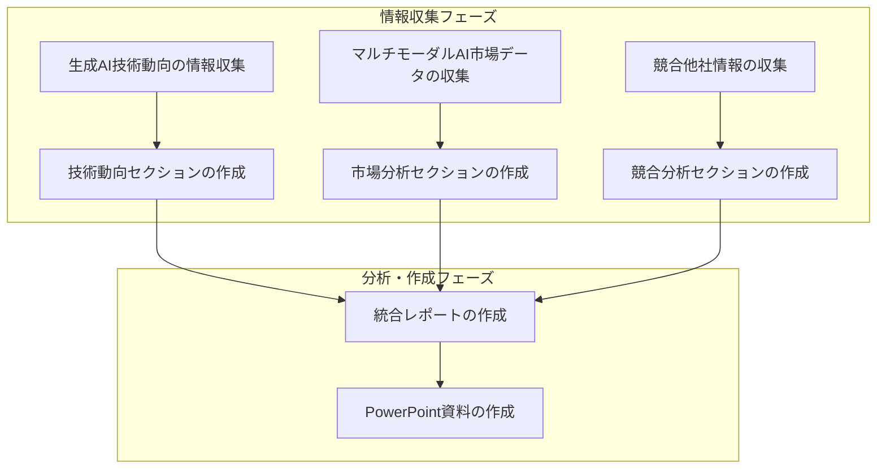
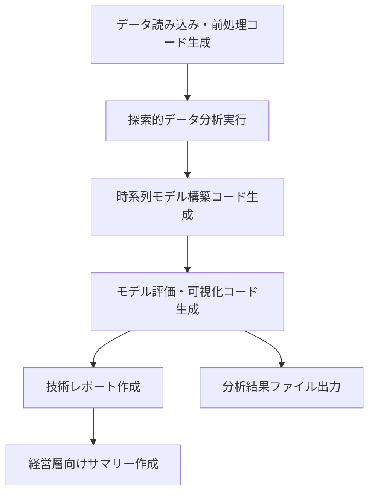

## サイトデザイン指示書

### 1\. サイトの目的とターゲットユーザー

このサイトは、複雑なワークフローやタスクの進捗を、**直感的かつプロフェッショナルに可視化・管理**することを目的としています。
ターゲットユーザーは、企画部門担当者、データサイエンティスト、プロジェクトマネージャーなど、多様なビジネスユーザーを想定しています。そのため、専門的な知識がなくても、タスクの状態やフローを容易に理解できるようなデザインを目指します。

### 2\. 全体的なトーン＆マナー

**モダンで信頼感のある印象**を基本とします。複雑な情報を整理して表示するため、**ミニマルでクリーンなデザイン**を重視し、情報の視認性を最大限に高めます。

  * **カラースキーム**:
      * メインカラーは、信頼感と落ち着きを表現する青系（例：ダークネイビー、ミッドナイトブルー）を基調とします。
      * アクセントカラーには、タスクの状態（完了、進行中、エラーなど）を明確に区別できるような、鮮やかすぎないグリーン、オレンジ、レッドなどを検討します。
      * 背景は、情報を際立たせるために、白やライトグレーなどのニュートラルカラーを使用します。
  * **フォント**:
      * システムフォントまたは、可読性の高いサンセリフ体（例：Noto Sans JP, Inter）を使用します。

### 3\. レイアウトと構成

v0.devの技術スタック（React, Next.js, Tailwind CSS, Shadcn UI）を念頭に置き、一般的なLLMアプリのサイドバーをベースとしたレイアウトを提案します。

#### 3.1. グローバルレイアウト

  * **ヘッダー**:
      * サイトロゴ、グローバルな検索バー、ユーザーアイコン（プロフィール、設定などへのリンク）を配置します。
      * シンプルなデザインで、常に表示されるように固定します。
  * **サイドバー（左側）**:
      * 一般的なLLMアプリのサイドバーをベースに、タスクの状態や概要をより補強したものを表示します。
      * サイドバー上部には、新規タスク作成ボタンや、タスクをフィルタリング・ソートするためのオプションを配置します。
      * サイドバーの主要エリアには、現在のプロジェクトに含まれる**タスクの一覧**を表示します。
          * 各タスクは、タイトル、現在のステータス（例：情報収集中、分析中、完了、エラー）、簡単な概要、最終更新日時などを表示します。
          * タスクのステータスは、色分けされたアイコンやシンプルなテキストで直感的に表現します。
          * ユーザーがタスクを選択すると、メインコンテンツエリアにそのタスクの詳細が表示されます。
      * サイドバー下部には、設定やヘルプなどへのリンクを配置します。
  * **メインコンテンツエリア（右側）**:
      * 選択されたタスクの詳細情報や、そのタスクの実行結果、関連するデータなどを表示します。
      * タスクの進行に伴い、動的にコンテンツが変化するエリアとなります。
      * タスクのフロー図（後述）や、生成されたレポートのプレビュー、関連するデータ表などを表示します。

#### 3.2. タスクの状態表示と操作

サイドバーのタスク一覧において、各タスクの状態を明確に表示し、操作できるようにします。

  * **ステータス表示**:
      * 「情報収集中」「分析中」「レポート作成中」「完了」「エラー」「待機中」などのステータスを、視覚的に分かりやすいアイコンとテキストで表示します。
      * 各ステータスは、Shadcn UIのバッジコンポーネントなどを活用し、色分けすることで一目で判別できるようにします。
  * **タスクの選択と詳細表示**:
      * サイドバーのタスクをクリックすると、メインコンテンツエリアにそのタスクの詳細（詳細な説明、現在の進捗、関連する出力など）が表示されます。
  * **タスク操作**:
      * タスクの横に、必要に応じて「一時停止」「再開」「キャンセル」などの操作ボタンを配置することも検討します。

### 4\. フローの表現（Mermaid記法）

各ユースケースにおけるタスクの依存関係とフローは、メインコンテンツエリアにMermaid記法でレンダリングされたグラフとして表示します。これにより、プロジェクト全体の流れや各タスクの関連性を視覚的に理解できます。

#### ユースケース1: 市場調査レポート作成（基本ワークフロー）

#### ユースケース2: データ分析レポート作成（技術的ワークフロー）

